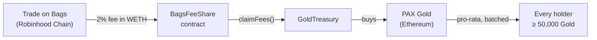

<div align="center">


# Gold

**Hold the token. Get paid in real gold.**


[](https://gldfi.net)
[]()
[]()
[]()

</div>

---

## What it does

Every Gold trade on [Bags](https://bags.fm) carries a 2% fee — **1% goes to holders as gold**.
The fee accrues in WETH, buys **PAX Gold** (one token = one vaulted troy ounce, issued by Paxos),
and gets sent to every wallet holding **50,000+ Gold**. No claiming. No staking.



## What's in this repo

| Piece | Where | What it is |
|---|---|---|
| 🌐 Landing site | `index.html` | Live at [gldfi.net](https://gldfi.net) — static, zero build step |
| 📡 Read API | `api/` | Dependency-free chain reader; refuses to show fake numbers |
| 📜 Contracts | `protocol/contracts/` | `GoldDistributor` + `GoldTreasury`, Solidity 0.8.26 |
| 🤖 Keeper | `protocol/keeper/` | Runs the cycle: sync holders → claim WETH → buy gold → pay |
| 🪂 Airdrop | `protocol/airdrop/` | Crash-safe PAXG sender — splits **earned** fees, never promises fixed amounts |
| ✅ Tests | `protocol/test/` | 25 passing, including the two bugs below |

## Bugs the tests caught before they cost money

**The insolvency bug.** `distribute()` rounded down per cycle while holders round down once
over the accumulated total. Since `Σ floor(x) ≤ floor(Σ x)`, the contract slowly promised
more gold than it held — and the last holder's payout reverted. Fixed with ceiling division;
a regression test is named after it.

**The sync deadlock.** The eligibility cursor only advanced when *every* moved wallet was
resynced — so a launch-day volume spike would freeze it permanently. Cursor now advances on
read; the backlog drains across cycles.

## Honest status

- ⚠️ **Pre-launch.** No token exists yet; every figure on the site is labelled illustrative.
- ⚠️ **Not audited.** One internal security review (4 defects found & fixed) ≠ an audit.
- ⚠️ Gold is delivered as **PAXG on Ethereum** — same wallet address, different network.
  The site explains where to see it.

## Run it locally

```bash
cd protocol && npm install
npx hardhat test                                  # 25 tests
npx hardhat node                                  # local chain
npx hardhat run scripts/deploy.js --network localhost
RUN_ONCE=1 node keeper/keeper.js                  # one full cycle
```

<div align="center">

<sub>Built for Robinhood Chain · PAXG: <code>0x45804880De22913dAFE09f4980848ECE6EcbAf78</code> (Ethereum mainnet)</sub>
</div>
